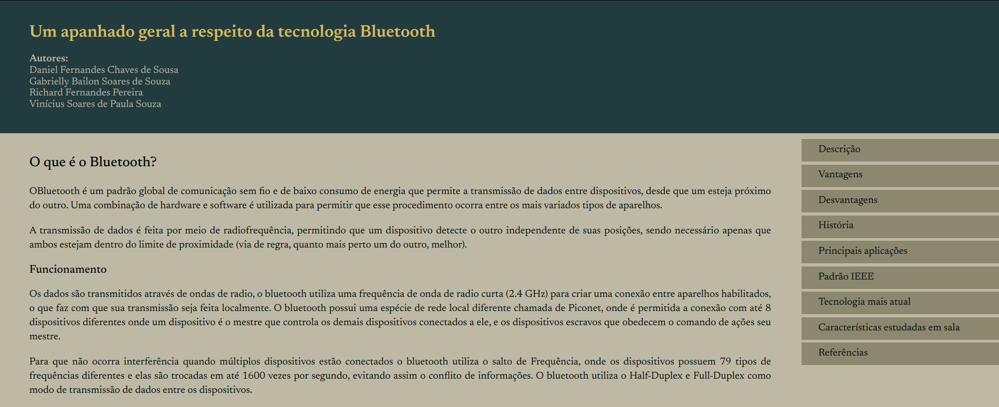

<h1 align="center">Artigo técnico: Bluetooth</h1>
 
---
 
## 📝 Tabela de conteúdo
-   [Sobre](#about)
-   [Preview](#demo)
-   [Construído usando](#built_using)
-   [Deploy](#deployment)
-   [Rodando o projeto](#getting_started)
-   [Autor](#authors)
 
## 🧐 Sobre <a name = "about"></a>
 
Artigo técnico sobre o Bluetooth para disciplina de Redes I
 
## 🎥 Preview <a name = "demo"></a>
 

 
## ⛏️ Consturído usando <a name = "built_using"></a>
 
-   HTML
-   CSS
-   Javascript
 
## 🚀 Deploy <a name = "deployment"></a>
 
Para visualizar a aplicação, acesse:
 
-   **Github Pages**: https://vsspaulasouza.github.io/tpRedesI-ArtigoTecnico/
 
---
 
## 🏁 Rodando o projeto <a name = "getting_started"></a>
 
SSiga as seguintes instruções para rodar a aplicação em sua máquina.

Faça o clone do projeto:

```
gh repo clone Vsspaulasouza/tpRedesI-ArtigoTecnico
```

Após isso, você pode executá-lo direto no navegador abrindo o arquivo index.html ou a partir da extenção [LiveServer](https://marketplace.visualstudio.com/items?itemName=ritwickdey.LiveServer) no VSCode.

---

## ✍️ Autor <a name = "authors"></a>

| [](https://github.com/Vsspaulasouza) |
| -------------------------------------------------------------------------------------------------------------- |

| [Vinícius Soares](https://github.com/Vsspaulasouza)
